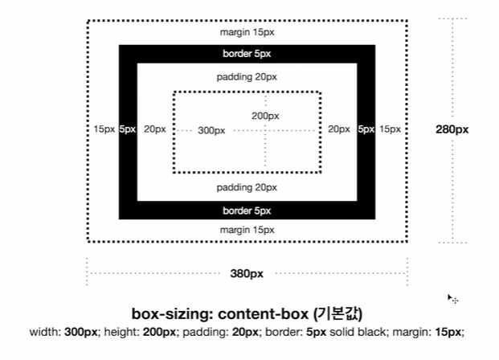
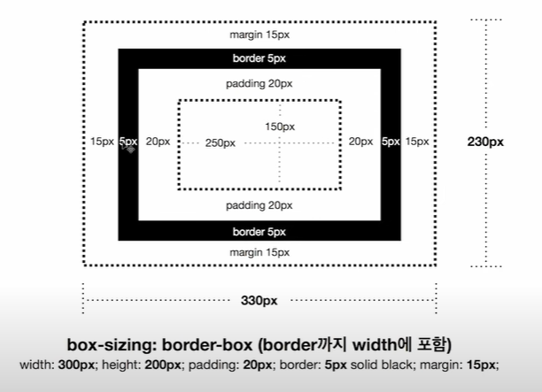

# CSS BOX MODEL

# CSS RESET

<a href="https://cssdeck.com/blog/scripts/eric-meyer-reset-css/">Eric Meyer's "Reset CSS"</a>

'웹 브라우저'마다 default 값으로 스타일이 적용되어 있기에 브라우저마다의 기본 디폴트 스타일 값이 아니라 동일한 CSS 스타일을 보여주기 위해 default 값을 초기화 해주어야 함.

한개의 CSS파일에서 작업하면 코드가 많아지므로 작업하던 style.css 파일에 @import를 사용해 리셋 파일을 추가해준다.
